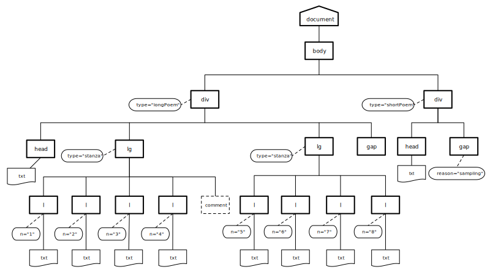
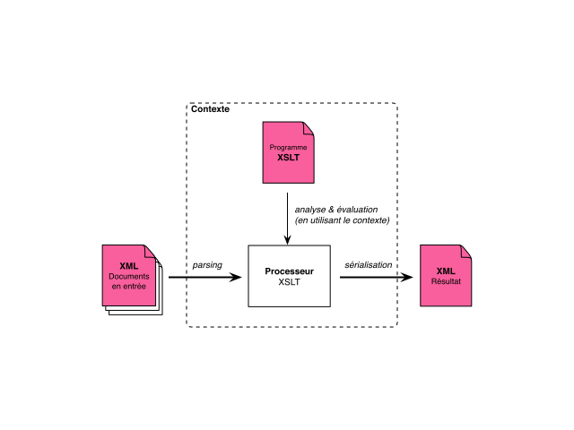
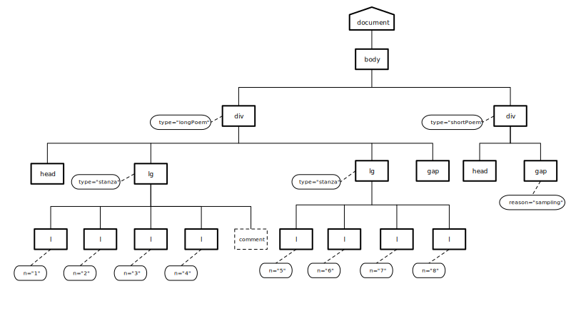

title: Usage avancé de la TEI
description: Emmanuel Château-Dutier,
theme: theme/remark-dark-em.css
name: inverse
layout: true
class: inverse

---

template: inverse
class: center middle
name: index

# Le langage XPath

### HNU3053/HNU6053 Humanités numériques : Utilisation avancée de la TEI

???
Lorsque l’on veut appliquer des traitements à des documents XML (transformation de documents p.e. pour produire une page web, création de liens hypertextes, extraction sélective d’informations p.e. dans une base de données XML native), il est souvent nécessaire de pouvoir localiser des fragments précis au sein de documents XML.

---
layout: false

### "XPath is a language for addressing parts of an XML document, designed to be used by both XSLT and XPointer"

### "The primary purpose of XPath is to address parts of an XML document."
.footnote[[XML Path Language 2.0, 2003](http://www.w3.org/TR/xpath20/)]

???

C’est précisément la vocation du langage XPath développé par le W3C :
- "XPath is a language for addressing parts of an XML document, designed to be used by both XSLT and XPointer"
- "The primary purpose of XPath is to address parts of an XML document."

Comme le suggère cette première citation, XPath a d’abord été conçu pour être utilisé au sein de langages dits hôtes ayant besoin d’identifier des portions précises dans un document. On utilise ainsi XPath avec XSLT pour sélectionner des nœuds, extraire des informations, ou encore effectuer des tests.

Les expressions XPath peuvent aussi être utiles pour naviguer précisément dans des documents XML en créant des pointeurs hypertextes sophistiqués dans le contexte du langage XPointer.

Plusieurs utilisations de XPath sont donc possibles
- pour désigner des ensembles de nœuds dans une transformation XSLT
- pour contrôler la qualité d’un document XML (exploration, analyse, vérification)
- pour paralléliser des textes

---

layout: false
.left-column[
  ## Historique
]
.right-column[

- première version du langage publiée en 1999

- immédiatement utilisée par **XSLT 1.0**

- premier langage de la famille XML à opérer sur un modèle de données

- seconde version du langage spécifiée en 2007

- support aux langages **XSLT 2.0** et **XQuery 1.0**

- s’appuie sur **XML Data Model** publié la même année[*]


.footnote[.red[**] [XML Path Language (XPath) 2.0](http://www.w3.org/TR/xpath20/), [XQuery 1.0 and XPath 2.0 Data Model (XDM)](http://www.w3.org/TR/xpath-datamodel/), [XSL Transformations (XSLT) Version 2.0](http://www.w3.org/TR/xslt20/)]
]

???

### Historique
La première version du langage a été publiée en 1999 et fut immédiatement utilisée par XSLT 1.0.

XPath est le premier langage de la famille XML à avoir opéré sur un **modèle de données** au sens d’un cadre formel permettant la représentation et la manipulation de données. La description de la version 1.0 de ce langage, publiée en 1999, contient en effet la description d’un modèle de données très simple où un document XML est représenté comme un arbre pouvant être composé de **sept types de nœuds**.

La seconde version du langage, XPath 2.0, a été spécifiée en 2007 et a servi de support aux langages XSLT 2.0 et XQuery 1.0.

La seconde version de XPath, s’appuie sur XML Data Model publié en même temps que la spécification XPath 2.0.

---
layout: false
.left-column[
  ## Programme
]
.right-column[

### [le modèle de données XML](xpath01.html)

### [les expressions XPath](xpath02.html)

### [évaluation des expressions](xpath03.html)

### [fonctions XPath](xpath03.html)
]

???
### Programme de l’après-midi
Une des caractéristiques essentielles du langage XPath, est qu’il s’appuie sur un modèle de données (XPath/XQuery pour la version 2.0) dont la connaissance est essentielle pour une bonne compréhension du langage.

Il s’agit d’un véritable langage fonctionnel typé. Ainsi, l’utilisateur manipule des expressions et non des instructions, et l’évaluation de ces expressions produit des valeurs appartenant à des types définis dans un système de types. La version 2.0 langage intègre le riche système de types de XML Schema.

Au cours de cette première présentation, nous commencerons par examiner le modèle de données XML, puis nous aborderons les diverses expressions XPath et de leur types, avant de nous concentrer sur des expressions servant à décrire des chemins pour sélectionner des ensembles de nœuds dans un arbre XML.

---

template: inverse
class: middle center

# Les expressions XPath

---
layout: false
.left-column[
## Expressions XPath
]

.right-column[
## Les types d’expressions XPath

XPath permet d’écrire des .red[expressions de chemin] (`path expressions`) qui permettent de sélectionner des fragments d’un document XML.

Mais les expressions XPath permettent aussi :
- d’effectuer des .red[calculs] sur le contenu des nœuds sélectionnés,
- d’écrire des .red[tests] pour sélectionner des nœuds,
- etc.
]

???
## Types d’expressions XPath

XPath permet d’écrire des .red[expressions de chemin] (`path expressions`) qui permettent de sélectionner des fragments d’un document XML.

Mais les expressions XPath permettent aussi :
- d’effectuer des .red[calculs] sur le contenu des nœuds sélectionnés,
- d’écrire des .red[tests] pour sélectionner des nœuds,
- etc.

---
.left-column[
## Expressions XPath
### (suite)
]

.right-column[
## Évaluation d’une expression XPath

- En XPath 2.0, toutes les valeurs manipulées sont des .red[séquences] (`sequences`).

- Une `séquence` est une collection ordonnée de zéro ou plusieurs items.

- Un `item` appartenant à une séquence est soit un nœud soit une valeur atomique.
]

???
## Évaluation d’une expression XPath

En XPath 2.0, toutes les valeurs manipulées sont des .red[séquences] (`sequences`).

- Une `séquence` est une collection ordonnée de zéro ou plusieurs items.

- Chaque `item` appartenant à une séquence est soit un nœud soit une valeur atomique.

---
.left-column[
## Expressions XPath
### (suite)
]

.right-column[
## types XPath

Une valeur atomique est une valeur appartenant à l’espace de valeur d’un .red[type atomique].

XPath 2.0 reconnaît comme types atomiques les types atomiques primitifs de [XML Schema](http://www.w3.org/TR/xmlschema-2/), ainsi que plusieurs types qui en dérivent.

La valeur d’une expression XPath 2.0 est .red[toute séquence autorisée par le modèle de données].
]

???
## types XPath

Une valeur atomique est une valeur appartenant à l’espace de valeur d’un type atomique.

XPath 2.0 reconnaît comme types atomiques les types atomiques primitifs de XML Schema, ainsi que plusieurs types qui en dérivent.

La valeur d’une expression XPath 2.0 est toute séquence autorisée par le modèle de données.

---
background-image:url(./images/XPathTypeHierarchy-1-items-3.1.png)

# XPath Datamodel 3.1

.footnote[https://www.w3.org/TR/xpath-datamodel-31/]

---

.left-column[
## Le modèle [XDM](http://www.w3.org/TR/xpath-datamodel/)
]

.right-column[
## Exemple d’expressions XPath

`12` est une .red[expression littérale] dénotant une valeur de type `xs:integer`

`15.5` est une .red[expression littérale] dénotant une valeur de type xs:decimal

`1, 2` est une expression construisant une .red[séquence] de deux .red[valeurs atomiques] de type `xs:integer`

auteur = "Dupont" est expression dont la valeur est de type `xs:boolean`
]
???
## Exemple d’expressions XPath

`12` est une .red[expression littérale] dénotant une valeur de type `xs:integer`

`15.5` est une .red[expression littérale] dénotant une valeur de type xs:decimal

`1, 2` est une expression construisant une .red[séquence] de deux .red[valeurs atomiques] de type `xs:integer`

auteur = "Dupont" est expression dont la valeur est de type `xs:boolean`

(En programmation informatique, une **valeur littérale** est une valeur donnée explicitement dans le code source d’un programme)

## L’utilisation par XPath 2.0 d’un système de types rigoureux a de nombreux avantages.

Il offre notamment la possibilité de détecter des erreurs lors d’une phase d’analyse statique.

Mais il peut poser des problèmes de compatibilité avec XPath 1.0, bien qu’ayant été conçu pour être compatible, les modèles de données présentent plusieurs différences notables.

---

## Les types définis par le XML Data Model (XDM)

```xquery
'string' (: chaîne de caractères :)
```

```xquery
1 (: entier :)
```

```xquery
1 + 1 + 1 (: somme :)
```

```xquery
1, 2, 3 (: séquence :)
```

---

Comme nous venons de le voir, XPath permet d’écrire différents types d’expressions

- arithmétiques ex. `1 + 2`
- booléennes ex. `true()`
- etc.

### Les expressions de chemins

Parmi ces expressions, celles de chemins (`path expressions`) représentent le cœur de ce langage dans la mesure où elles permettent de .red[sélectionner une séquence de nœuds] en spécifiant un chemin à suivre à partir d’un point de départ.

???

## Expressions de chemins

Comme nous venons de le voir, XPath permet d’écrire différents types d’expressions (arithmétiques, booléennes, etc.).

Parmi ces expressions, les expressions de chemins (`path expressions`) représentent le cœur de ce langage dans la mesure où elles permettent de **sélectionner une séquence de nœuds** en spécifiant un chemin à suivre à partir d’un point de départ (la racine ou un autre nœud de la structure)

---
.left-column[
## Expressions XPath
]

.right-column[
## Les expressions de chemins
### L’analogie avec les systèmes de fichier

Chemin absolu

```bash
	/Users/emmanuelchateau/formENC2014/xpath01.tei.xml
```

Chemin relatif

```bash
	formENC2014/xpath01.tei.xml
```]

???

Pour comprendre cette notion de chemin, on peut faire l’analogie avec d’autres structures hiérarchiques comme les systèmes de fichiers Unix où il est nécessaire de pouvoir noter le chemin menant à un fichier ou un groupe de fichiers spécifiques.

Par exemple, le système de fichiers, dont la racine a pour nom /.

Dans ce système, un fichier est désigné par un nom qui correspond au chemin (`path`) que l’on doit suivre dans la structure pour atteindre ce fichier.
Le chemin peut partir de la racine, on parle alors d’un chemin absolu. Ou il peut partir d’un autre point du système, on parle dans ce cas d’un chemin relatif, ce chemin est dit relatif car son interprétation dépend de l’endroit où l’on se trouve.

Dans un chemin Unix, chaque pas (ou étape) est séparé par le caractère / qui permet de passer d’un niveau de la structure à l’autre.

Par exemple, le chemin absolu : /Users/emmanuelchateau/formENC2014/xpath01.tei.xml désigne, le fichier xpath01.tei.xml que l’on peut atteindre en partant de la racine puis en passant successivement par les répertoires Users, emmanuelchateau et formENC2014.

L’interpréation de formENC2014/xpath01.tei.xml n’est, quant à elle, pas unique. Elle dépend de l’endroit où l’on se trouve quand l’on saisit ce chemin. Si l’on se trouve dans le répertoire /Users/emmanuelchateau, il désigne le même fichier que le chemin absolu précédent. Mais, si l’on se trouve dans le répertoire usr et que ce répertoire contenait aussi des répertoires emmanuelchateau et formENC2014, et un fichier également nommé xpath01.tei.xml, alors ce chemin relatif désignerait un fichier différent.

Cette analogie avec les systèmes de fichier présente cependant des limites.
- Tout d’abord, XPath est destiné à manipuler des structures XML composées de types de nœuds (éléments, attributs, commentaires, textes, instruction de traitements, etc.) bien plus variées que les seuls fichiers et répertoires d’un système de fichiers.
- Enfin, les concepteurs de XPath ont développé des mécanismes de parcours beaucoup plus sophistiqués que la simple navigation père/fils que l’on rencontre dans les systèmes de fichiers. Cette précision dans l’identification repose sur la notion d’axes XPath.

C’est maintenant ce que nous allons voir !

---

template: inverse
class: middle center

# Les axes XPath

---

## Sérialisation arborescente de [phares.tei.xml](./exemplesTEI/phares.tei.xml)




???
Avant tout, il est très important de comprendre que pour qu’une expression XPath puisse opérer sur un document XML, ce dernier doit au préalable être traduit en une instance de ce modèle de donnée.

Plusieurs sérialisation d’un document XML sont possibles. La représentation graphique d’un document XML peut nous permettre de mieux comprendre les axes.

Tout à l’heure nous avons représenté dans cet arbre les éléments du documents sous la forme suivante :
- nœud éléments par des carrés
- nœud attributs par des ovales
- nœud de type texte sans bordure
- les relations père/fils entre les nœuds sont notées par un trait en gras
- les relations entre un élément et son attribut sont notées par un trait pointillé

C’est à partir de cet arbre que l’on va examiner les différents axes spécifiés dans le modèle de données.

En XPath, on peut effectuer des déplacements selon des axes variés.

Par exemple, depuis le nœud <lg> au milieu de la diapositive qui nous sert de contexte initial, on pourrait faire un pas vers :
- le nœud père <div>, on utilise alors l’axe parent
- le nœud fils <l>, on utilise alors l’axe child
- le nœud attribut type, on utilise alors l’axe attribut
- le nœud frère <lg> qui le précède, on utilise alors l’axe preceding-sibling
- etc.

---

template: inverse
class: middle center

# Notation XPath

---
## Notation des étapes d’un chemin XPath

Un chemin peut se composer de plusieurs étapes, ou pas (.red[location steps]).

- Chaque étape est séparée de la précédente par un caractère `/`

- Par convention, on désigne le nœud document avec le caractère `/`.

- On distingue ainsi les chemins absolus, partant de cette racine, des chemins relatifs.

#### un chemin XPath sera de la forme :

pour un chemin absolu
```xpath
  /étape1/étape2/.../étapeN
```

pour un chemin relatif
```xpath
  étape1/étape2/.../étapeN
```

???
## Notation des étapes d’un chemin XPath

Un chemin peut se composer de plusieurs étapes, ou pas (.red[location steps]).

- Chaque étape est séparée de la précédente par un caractère `/`

- Par convention, on désigne le nœud document par le caractère `/`.

- On distingue aussi les chemins absolus, partant de cette racine, des chemins relatifs.

Globalement, un chemin XPath sera de la forme :

pour un chemin absolu
```xpath
/étape1/étape2/.../étapeN
```

pour un chemin relatif
```xpath
étape1/étape2/.../étapeN
```

---
# Structure d’une étape de chemin XPath

Pour chaque étape, on peut préciser :

- dans quelle direction on souhaite se déplacer (.red[axis specifier])

- quels nœuds ou types de nœuds particuliers (éléments, attributs, commentaires, etc.) on souhaite identifier sur cet axe (.red[test node])

- éventuellement, un ou plusieurs .red[prédicats] qui permettent de filtrer l’ensemble de nœud désigné par les indications précédentes

### Forme d’une expression XPath :

```xpath
axe::testNode[prédicat]/.../axe::testNode[prédicat][...]
```

???

## Structure d’une étape de chemin XPath

Pour chaque étape, on peut préciser :

- dans quelle direction on souhaite se déplacer (.red[axis specifier])

- quels nœuds ou types de nœuds particuliers (éléments, attributs, commentaires, etc.) on souhaite identifier sur cet axe (.red[test node])

- éventuellement, un ou plusieurs .red[prédicats] qui permettent de filtrer l’ensemble de nœud désigné par les indications précédentes

Ces prédicats prennent la forme d’une expression booléenne

### Forme d’une expression XPath :

```xpath
axe::testNode[prédicat]/.../axe::testNode[prédicat][...]
```

---

## Notation des axes (.red[axis specifier])

Ces axes sont introduits en écrivant le nom de l’axe suivi du délimiteur `::`
​```xpath
child::
```
sert par exemple à noter l’axe fils

​```xpath
ancestor::
```
sert par exemple à noter l’axe des ancêtres


???
## Notation des axes (.red[axis specifier])

Ces axes sont introduits en écrivant le nom de l’axe suivi du délimiteur `::`
```xpath
child::
```
sert par exemple à noter l’axe fils

```xpath
ancestor::
```
sert par exemple à noter l’axe des ancêtres

---

# Test du type de nœuds à sélectionner (.red[node test])

Composante qui précise quels nœuds ou type de nœuds on veut sélectionner :

- on peut indiquer un nom précis

Ou être plus générique au moyen des expressions suivantes :

- `text()` sélectionne n’importe quel nœud de type texte
- `node()` sélectionne n’importe quel nœud de type quelconque
- `comment()` sélectionne n’importe quel nœud de type commentaire
- `processing-instruction()` sélectionne n’importe quel nœud de type instruction de traitement

- `*` sélectionne un nœud de nom quelconque de type `element` sur un axe permettant de sélectionner des éléments, ou de type attribut sur l’axe attribute, ou de type espace de nom sur l’axe namespace

???
Cette composante d’une étape sert à préciser quels nœuds ou types de nœuds particuliers on souhaite identifier sur un axe.
- On peut soit indiquer un nom précis (`lg`, `div`), soit être plus générique et utiliser une des expressions suivantes :
- `text()` sélectionne n’importe quel nœud de type texte
- `node()` sélectionne n’importe quel nœud de type quelconque
- `comment()` sélectionne n’importe quel nœud de type commentaire
- `processing-instruction()` sélectionne n’importe quel nœud de type instruction de traitement

- `*` sélectionne un nœud de nom quelconque de type `element` sur un axe permettant de sélectionner des éléments, ou de type attribut sur l’axe `attribute`, ou de type espace de nom sur l’axe `namespace

---

# Exemples

En conséquence que signifient les expressions suivantes ?

```xapth
/child::l

child::l

div/attribute::type
```

???
### Exemples

En conséquence que signifient les expressions suivantes ?

```xapth
/child::l
child::l
div/attribute::type
```
---

# Raccourcis

En pratique, on peut utiliser une notation abrégée qui permet d’alléger l’écriture des chemins.

- Comme l’axe fils, est l’axe par défaut, on peut écrire indifféremment `child::lg` ou `lg`
- `//` équivaut à `/descendant-or-self::node()/`
- `.` désigne le nœud contexte ou `self::node()`
- l’axe des attributs peut être abrégé en `@` on écrit indifféremment `attribute::type` ou `@type`

### Rappels :
-`/`, désigne le nœud document au début d’une expression
- `*` sélectionne un nœud de nom quelconque de type `element` sur un axe permettant de sélectionner des éléments, ou de type `attribut` sur l’axe `attribute`, ou de type espace de nom sur l’axe `namespace`

???
### Raccourcis

En pratique, on peut utiliser une notation abrégée qui permet d’alléger l’écriture des chemins.

- Comme l’axe fils, est l’axe par défaut, on peut écrire indifféremment `child::lg` ou `lg`
- `//` équivaut à `/descendant-or-self::node()/`
- `.` désigne le nœud contexte ou `self::node()`
- l’axe des attributs peut être abrégé en `@` on écrit indifféremment `attribute::type` ou `@type`

### Rappels :
-`/`, désigne le nœud document au début d’une expression
- `*` sélectionne un nœud de nom quelconque de type `element` sur un axe permettant de sélectionner des éléments, ou de type `attribut` sur l’axe `attribute`, ou de type `espace de nom` sur l’axe `namespace`

---

# Exercices

En conséquence, que signifient les expressions suivantes ?

```xpath
/*

div/*

div/*/@*

//*
```

---
## Les axes de type .red[forward axes]

axe | signification | types de noeud
:--|:--|:--
`child`                 | fils du nœud contexte| `element`, `text`, `comment`, `processing instruction`
`descendant`            | fils, petits-fils et tous les descendants du nœud contexte| `element`, `text`, `comment`, `processing instruction`
`descendant-or-self`    | qui descendent du nœud contexte ainsi que le nœud contexte lui-même| `element`, `text`, `comment`, `processing-instruction`
`following-sibling`     | frères droits du nœud contexte.| `element`, `text`, `comment`, `processing instruction`
`following`             | situés après le nœud contexte (à l’exception des descendants)| `element`, `texte`, `comment`, `processing instruction`
`attribute`             | attribut du nœud contexte|
`namespace`             | espace de nom du noeud contexte|
`processing instruction`| qui descendent du nœud contexte|


???
XPath distingue ainsi plusieurs catégories d’axes de déplacement dans l’abre XML.
## Les axes de type .red[forward axes]

- `child` : sélectionne tous les enfants du nœud contexte, dans l’ordre du document.
L’axe child ne sélectionne rien pour tous les nœuds qui ne sont ni un nœud document ni un nœud élément.
Rappel : les enfants d’un nœud élément n’incluent pas ses attributs ou espaces de noms, seulement le nœuds textuels, les nœuds de type élément, instruction de traitement et commentaire.

- `descendant` : sélectionne tous les enfants du nœuds contexte et leurs enfants, et ainsi de suite récursivement dans l’ordre du document.
Si le nœud contexte est un élément, l’axe descendant contient tous les nœuds texte, élément, commentaire, et instruction de traitement qui apparaissent dans le document source à l’intérieur des balises de cet élément.

- `descendant-of-self` : idem, à la différence que le premier nœud sélectionné est le nœud contexte.

- following` : sélectionne tous les nœuds qui apparaissent après le nœud contexte dans l’ordre du document, en excluant les descendants du nœuds contexte.
Si le nœud d’origine est un nœud element, l’axe comporte tous les nœuds texte, élément, commentaire, et instruction de traitement du document qui débute après la balise fermente du nœud contexte.
L’axe following ne contiendra jamais de nœuds attributs ou d’espace de noms.

- `following-sibling` : Sélectionne tous les nœuds qui suivent le nœud contexte dans l’ordre du document et qui sont les enfants du même nœud parent.
Si le nœud contexte est un nœud racine, un nœud attribut, ou espace de noms, alors l’axe following-sibling sera toujours vide.

- `attribute` : si le nœud contexte est un élément, cet axe sélectionne tous ses nœuds attributs, dans un ordre arbitraire.
Sinon, il ne sélectionne rien.

- `namespace` : si le nœud d’origine est un élément, cet axe sélectionne tous les nœuds d’espace de nom qui sont dans la portée de cet élément dans un ordre arbitraire.

---
## Les axes de type .red[reverse axes]

axe | signification | types de noeud
:--|:--|:--
`parent`            | père du nœud contexte | `element`, `document`
`ancestor`          | ancêtres du nœud contexte (parent du nœud contexte, ou parent du partent, etc.) | `element`, `document`
`ancestor-or-self`  | ancêtres du nœud contexte ainsi que le nœud contexte lui-même | `element`, `document`
`preceding`         | situés avant le nœud contexte (à l’exclusion des nœuds ancêtres) |  `element`, `text`, `comment`, `processing instruction`
`preceding-sibling` | frères gauches du nœud contexte |  `element`, `text`, `comment`, `processing instruction`

XPath fournit enfin un axe particulier nommé `self` qui permet de sélectionner le nœud servant de contexte lui-même.


???
## Les axes de type .red[forward axes]
XPath distingue également une catégorie d’axe .red[reverse axes]
dont la particularité est de ne pouvoir supporter un déplacement que depuis le nœud qui sert de contexte, ou des nœuds situés avant ce nœud dans l’ordre du document :
- `parent` : cet axe sélectionne un seul nœud parent du õud contexte. Si le nœud contexte est un nœud document, l’axe parent est vide.
- `ancestor` : sélectionne tous les nœuds qui sont les ancêtres du nœud contexte, dans l’ordre inverse du document, jusqu’au nœud document.

- `ancestor-or-self` : sélectionne les mêmes nœuds que l’axe ancestor mais en débutant par le nœud contexte plutôt que par son parent.

- `preceding` : sélectionne tous les nœuds qui apparaissent avant le nœud contexte en excluant ses ancêtres, dans l’ordre inverse du document.
Si le nœud contexte est un élément, l’axe contient tous les nœuds texte, élément, commentaires et instruction de traitement qui se terminent avant la balise ouvrante de l’élement contexte dans le document.
L’axe ne contiendra jamais d’attribut ou de nœud espace de nom.

- `preceding-sibling` : tous les nœuds qui précèdent le nœud origine et qui sont les enfants du même parent dans l’ordre inverse du document.
Toujours vide depuis un nœud attribut ou espace de nom.

XPath fournit enfin un axe particulier nommé `self`
- `self` : sélectionne un nœud unique, le nœud contexte lui-même. Cet axe n’est jamais vide.

## Nota : un attribut n’est pas le fils d’un élément ! même si dans XPath on peut atteindre l’élément depuis l’attribut en suivant l’axe parent, etc.

---

## Axes child, parent, attribute


---

## Axes ancestor


---

## Axes following-sibling et preceding-sibling


---

## Axe following


---

# Prédicats

```xpath
div[child::lg]
```

```xpath
div[lg]
```

```xpath
div[1]
```

```xpath
div[p='test']
```

---
template: inverse
class: middle center

# Les fonctions XPath

---
layout: false
## Fonctions dans des expressions XPath

Voici quelques unes des fonctions XPath communes :

- `concat()` concaténation
```xpath
concat('ligneN', l/@n)
```

- `normalize-space()` normaliser les espaces
```xpath
normalize-space(//lg/l)
```

- `string()` valeur textuelle du nœud
```xpath
string(/l[@n="2"])
```

Liste complète des fonctions XPath dans la spécification XPath (http://www.w3.org/TR/xpath)

???
### Fonctions dans des expressions XPath

XPath propose également un certain nombre de fonctions prédéfinies qui permettent de manipuler des données à partir de noeuds ou de fournir des prédicats.

Ces fonctions peuvent s'avérer très utiles pour manipuler des chaînes textuelles, vérifier la valeur d'une clef de travail ou son type, ou encore réaliser des calculs.

Voici quelques unes des fonctions XPath communes :

`concat()`
Cette fonction permet de combiner un nombre quelconque de chaînes de caractères avec des données extraites de noeuds en respectant l'ordre dans lequel les paramètres sont spécifiés.
On peut indiquer des chemins XPath en tant que paramètres.
Les chaînes de caractères littérales sont fournies entre apostrophes.
Par exemple :
concat('chaîneDeCaractères', {expressionXPath})


`normalize-space()`
Permet d'enlever tous les espaces de début et de fin du paramètre d'entrée et de normaliser l'ensemble de l'espace dans l'entrée en caractères espace et sauts de ligne uniques. Par exemple :
normalize-space(/Job/Address/Line1)

`string()`
Permet de convertir le paramètre en type de données chaîne. Cette fonction permet de s'assurer que des noeuds numériques ou de date sont traités en tant que chaînes. Par exemple :
string(/PurchaseOrder/VendorID)

`translate()`
Permet de remplacer des caractères par d'autres caractères dans le premier paramètre que vous spécifiez. Le deuxième paramètre est le ou les caractères à remplacer et le troisième paramètre correspond aux caractères de remplacement. Cette fonction peut s'avérer utile pour vous assurer que des clés de travail sont toutes en majuscules, par exemple.
translate(/Issue/ShortDescr,

'abcdefghijklmnopqrstuvwxyz',

'ABCDEFGHIJKLMNOPQRSTUVWXYZ')

Vous trouverez la liste complète des fonctions XPath dans la spécification XPath (http://www.w3.org/TR/xpath).

---
# Autres fonction utiles

Voici d'autres fonctions XPath très utiles :

- `false()`, `true()`, `not(arg)` booléennes

```xpath
//l[not(@n="5")]
```
- `number(arg)`, `count(sequence)`, sum(sequence),...
```xpath
count(//l)
```
- `position()`
```xpath
position(//l[@n="6"])
```

Les .red[opérateurs] `=`, `!=`, `<`, `>`, `<=`, `>=` peuvent être employées pour les types numériques, chaînes et boooléens.

On dispose également des .red[connecteurs logiques] `and`et `or`.

Liste complète des fonctions XPath dans la spécification XPath (http://www.w3.org/TR/xpath)

???

## les fonctions booléennes peuvent vous permettre de réaliser des tests sur des arguments

## Les fonctions numériques peuvent vous permettre des réaliser des opérations arithmétiques sur des séquences de nœuds

`count()`
Vous permet de compter le nombre de noeuds dans le paramètre que vous spécifiez. En règle générale, le paramètre est une expression de chemin XPath qui identifie plusieurs noeuds, par exemple, tous les noeuds Item qui sont des enfants de PODetail. Par exemple :
count({expressionXPath})

---
name: part2
template: inverse
class: middle center

# Qu’est-ce que XSLT ?

---
layout: false
.left-column[
## Qu’est-ce que XSLT ?
]

.right-column[
## un langage informatique, certes !
- XSL e.red[X]tensible .red[S]tylesheet .red[L]anguage
- un langage informatique dont les spécifications ont été publiées par le W3C en novembre 1999, en même temps que celles du langage XPath (XML Path) pour sa première version
- XSL se compose de deux parties XSL.red[T] pour .red[Transformations] et XSL.red[-FO] pour .red[Formating Object]
- la [seconde version du langage XSLT](http://www.w3.org/TR/xslt20/) a été publiée en 2007 en même temps que [XPath 2.0](http://www.w3.org/TR/xpath20/)
- une version 3.0 est en préparation
]
???
## un langage informatique, certes !
- XSLT e.blue[X]tensible .blue[S]tylesheet .blue[L]anguage
- un langage informatique dont les spécifications ont été publiées par le W3C en novembre 1999, en même temps que celles du langage XPath (XML Path) pour sa première version
- XSL se compose de deux parties XSL.blue[T] pour .blue[Transformations] et XSL.blue[-FO] pour .blue[Formating Object]
- la [seconde version du langage XSLT](http://www.w3.org/TR/xslt20/) a été publiée en 2007 en même temps que [XPath 2.0](http://www.w3.org/TR/xpath20/) dont il utilise la syntaxe pour identifier les éléments
- une version 3.0 est en préparation

---
.left-column[
## Qu’est-ce que XSLT ?
]

.right-column[
## Historique

### Le cahier des charges
- langage de transformation de XML
- capable de générer d’autres formats à partir du document source
- écrit en XML
- qui permet la réutilisation d’instructions
- sans ordre de traitement
- extensible

### = un .red[langage déclaratif], basé sur des instructions (ou règles) non ordonnées

### = XSLT 2.0 est .red[langage fonctionnel], Turing complet
]

???
## Historique

### Le cahier des charges
- langage de transformation de XML
- capable de générer d’autres formats à partir du document source
- écrit en XML
- qui permet la réutilisation d’instructions
- sans ordre de traitement
- extensible

### = un langage déclaratif, basé sur des instructions (ou règles) non ordonnées
(comme CSS) mais dont les fonctionnalités sont bien plus avancées.

Cela donne un langage déclaratif basé sur des instructions (on dit des règles) non ordonnées, comme CSS, mais dont les fonctionnalités sont beaucoup plus puissantes.

### = XSLT 2.0 est langage fonctionnel, turing complet

On peut dire que c’est un langage fonctionnel car il est sans effets de bords (il n’y a pas de modifications de l’environnement ou du document source au cours du traitement)

---
.left-column[
## Processus de transformation .red[XSLT]
]

.right-column[


]
???

Ce schéma présente le processus à l’œuvre lorsque l’on associe une feuille de style et un document source.

Un programme XSLT spécifie une sortie à produire à partir d’un segment ou d’un fichier XML, si ce segment existe dans le document fourni en entrée et répond à certains critères.

XSLT n’est pas un langage procédural, car un programme XSLT se compose d’une collection de règles modèles qui définissent la sortie à produire lorsque des motifs particuliers concordent dans l’entrée.

Le résultat est une fonction de l’entrée.
[TODO revoir]

---
.left-column[
## Qu’est-ce que XSLT ?
]

.right-column[
## processus de traitement (en bref)
XSLT est .red[une application XML pour la spécification de règles permettant de transformer un document XML en un autre document XML]

- un document XSLT contient des règles modèles
- chaque règle possède un motif ainsi qu’un modèle
- un processeur XSLT compare ces motifs avec les nœuds d’un document XSLT donné en entrée
- lorsqu’il y a correspondance il écrit le modèle de cette règle dans l’arbre de destination
- une fois le processus terminé, il sérialise l’arbre de sortie en un autre document XML ou dans un autre format comme du texte brut, un fichier CSV, ou du HTML
]
???
## Le processus de traitement (en bref)
"XSLT est .red[une application XML pour la spécification de règles permettant de transformer un document XML en un autre document XML].

Un document XSLT – c’est-à-dire une feuille de style XSLT – contient des règles modèles.

Chaque règle possède un motif ainsi qu’un modèle. **On utilise XPath pour identifier les éléments à traiter**.

Un processeur XSLT compare les nœuds d’un document XML fourni en entrée avec les règles modèles présentes dans une feuille de style.

Lorsqu’il y a correspondance, il écrit le modèle de cette règle dans l’arbre de destination.

Une fois le processus terminé, il sérialise l’arbre de sortie en un autre document XML ou dans un autre format comme du texte brut, un fichier CSV, ou du HTML
(XML en concentré, p. 157)

---
.left-column[
## Qu’est-ce que XSLT ?
]

.right-column[
## le point sur les versions
- à qqs différences près, on peut considérer XPath et XSLT 1.0 comme des sous-ensembles de XPath 2.0 et XSLT 2.0
- problèmes de compatibilité de XSLT 2.0 avec l’environnement PHP5 (en passe d’être résolus)
- de nombreuses choses plus simples à traiter en XSLT 2.0, mais une plus grande complexité du langage
]

???
À quelques différences près, on peut considérer XPath et XSLT1 comme des sous-ensembles de XSLT2 et XPath 2
Abordera aujourd’hui XPath 2.0 et XSLT 2.0 pour plus de facilité

Pendant longtemps problème de compatibilité XPath 2.0 avec environnement PHP
En passe d’être réglé par le portage du processeur Saxon en C++

Certaines choses plus simples à faire en XPath 2.0 qu’avec XPath 1.0
Mais plus grande complexité du langage.

---

background-image: url(./images/whatXSLTCanDo.png)

---

# BaseX

Bases de données XML natives

- http://basex.org
- http://exist-db.org
- http://www.marklogic.com
- ...

XQuery (Standard W3C)

---

## Spécifications XPath

* [XPath 1.0](https://www.w3.org/TR/xpath/)
* [XPath 2.0 Data Model (XDM)](https://www.w3.org/TR/xpath-datamodel/), [XPath 2.0](https://www.w3.org/TR/xpath20/), [XPath 2.0 Functions and Operators](https://www.w3.org/TR/xpath-functions/) and [XPath 2.0 Formal Semantics](https://www.w3.org/TR/xquery-semantics/)
* [XPath 3.0 Data Model (XDM)](https://www.w3.org/TR/xpath-datamodel-30/), [XPath 3.0](https://www.w3.org/TR/xpath-30/) and [XPath 3.0 Functions and Operators](https://www.w3.org/TR/xpath-functions-30/)
* [XPath 3.1 Data Model (XDM)](https://www.w3.org/TR/xpath-datamodel-31/), [XPath 3.1](https://www.w3.org/TR/xpath-31/) and [XPath 3.1 Functions and Operators](https://www.w3.org/TR/xpath-functions-31/)

## Languages hôtes

* XSLT: [XSLT 1.0](https://www.w3.org/TR/xslt), [XSLT 2.0](https://www.w3.org/TR/xslt20/), [XSLT 3.0](https://www.w3.org/TR/xslt-30/)
* XPointer: [XPointer](https://www.w3.org/TR/xptr/)
* XQuery: [XQuery 1.0](https://www.w3.org/TR/xquery/), [XQuery 1.1](https://www.w3.org/TR/xquery-11/), [XQuery 3.0](https://www.w3.org/TR/xquery-30/)
* XForms: [XForms 1.0](https://www.w3.org/TR/2003/REC-xforms-20031014/), [XForms 1.1](https://www.w3.org/TR/xforms/), [XForms 2.0](https://www.w3.org/TR/xforms20/)
* XProc: [XProc 1.0](https://www.w3.org/TR/xproc/), [XProc 1.1](http://spec.xproc.org/master/head/xproc11/), [XProc 2.0](https://www.w3.org/TR/xproc20/)
* Schematron: [ISO Schematron 2006](http://schematron.com), [ISO Schematron 2016](http://schematron.com)
* EXPath: [EXPath](https://www.w3.org/community/expath/)

---

template: inverse

## Écriture d’étapes simples (navigation dans les axes)

---
layout: false

## Sérialisation arborescente de [phares.tei.xml](./exemplesTEI/phares.tei.xml)


---
## `/body/div/lg` ?


---
## `/body/div/@type` ?
rappel : @ = attribute


---
## `/body/div/lg/l` ?


---
## `l/@n`


---
## `ancestor::lg` ?


---
## `descendant::l`?


---
## `//lg` ?


---
## `//lg/../@type` ?


---
## `//lg/following-sibling::l` ?


---
## `//lg/following::l` ?


---
template: inverse

## Écriture d’étapes avec prédicats

---
## `/body/div/lg/l[@n="2"]`?


---
## `/body/div[@type="shortPoem"]/head`?


---
## `//l[3]` ?

