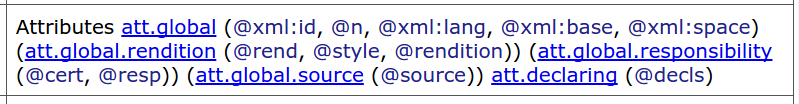

title: ODD for customizationPersonnalisation avec ODD
description: , 
theme: theme/remark-dark-em.css
name: inverse
layout: true
class: inverse

---
class: center middle

# Personnalisation avec ODD


---
layout: false

# ODD est aussi un langage de personnalisation 

On se sert du système qui sert à définir la TEI pour spécifier ses propres choix dans la TEI.

Un ODD de personnalisation est spécifié par rapport à un autre ODD&nbsp;; le plus souvent celui qui définit la version actuelle des Guidelines, mais pas obligatoirement.
* en sélectionnant des modules

* en sélectionnant parmi les objets (éléments, classes, datatypes, macros) fournis par ces modules

* en supprimant ou modifiant quelques uns des attributs fournis par ces objets

* en modifiant ou remplaçant quelques parties de ces spécifications (par ex. les valList)

* éventuellement en ajoutant des spécifications d’objets nouveaux


---


# Comment créer un ODD

Comme vous le savez déjà, un ODD est un document TEI comme tous les autres. Il peut donc être rédigé ou modifié dans n’importe quel éditeur de code XML. 

Plusieurs outils peuvent être utiles pour faciliter la production d’une spécification initiale&nbsp;:

* [http://www.tei-c.org/Roma](http://www.tei-c.org/Roma)

* [ODD By Example stylesheet](http://teic.github.io/TCW/howtogenerate.html)

Nous allons approfondir quelques notions déjà évoquées, et ensuite vous inviter à créer votre propre ODD.

---


# Création d’une personnalisation

Rappel&nbsp;: On utilise l’élément `<schemaSpec>` pour spécifier un schéma

* L’attribut `@ident` obligatoire fournit un nom pour le schéma

* L’attribut `@start` indique le ou les noms des élément(s) racine(s) du schéma

* L’attribut `@source` indique l’emplacement des déclarations référencées par le schéma (par ex une version spécifique de TEI P5)

* Les attributs `@docLang` et `@targetLang` permettent la sélection des langues à utiliser pour les descriptions d’éléments et pour les noms d’élément respectivement, en supposant la présence dans cette source des traductions requises

```xml
<schemaSpec start="TEI" ident="testschema" 
  source="tei:1.5.0" docLang="fr">
          <!-- declarations -->
</schemaSpec>
```

---


# Composants d’un `<schemaSpec>`

* `<moduleRef>`&nbsp;: un ensemble d’objets fournis par un module

* `<elementSpec>`, `<classSpec>`, `<dataSpec>`, `<macroSpec>` (etc.)&nbsp;: des objets nouveaux

* `<elementRef>`, `<classRef>`, `<dataRef>`, `<macroRef>`(etc.)&nbsp;: des objets déjà existants quelque part

La localisation des objets référencés est spécifiée par un attribut `@source`&nbsp;: par défaut il s’agit de la version la plus récente de la TEI P5

---


# Sélection par exclusion

Vous pouvez spécifier les éléments que vous souhaitez supprimer parmi ceux proposés par un module&nbsp;: 
```xml
<schemaSpec start="TEI" ident="testschema">
  <moduleRef key="core" except="mentioned said"/>
  <moduleRef key="header"/>
  <moduleRef key="textstructure"/>
</schemaSpec>
```


ou également&nbsp;: 
```xml
<schemaSpec start="TEI" ident="testschema">
  <moduleRef key="core"/>
  <moduleRef key="header"/>
  <moduleRef key="textstructure"/>
  <elementSpec ident="mentioned" mode="delete"/>
  <elementSpec ident="said" mode="delete"/>
</schemaSpec>
```


(L’attribut `@mode` contrôle la résolution de déclarations multiples)

---


# Sélection par inclusion

Vous pouvez spécifier les éléments que vous souhaitez inclure parmi ceux qui sont proposés par un module&nbsp;: 
```xml
<schemaSpec start="TEI" ident="testschema">
  <moduleRef key="core"/>
  <moduleRef key="header"/>
  <moduleRef key="textstructure" include="body div"/>
</schemaSpec>
```


ou également&nbsp;: 
```xml
<schemaSpec start="TEI" ident="testschema">
  <moduleRef key="core"/>
  <moduleRef key="header"/>
  <elementRef key="div"/>
  <elementRef key="body"/>
</schemaSpec>
```


Attention&nbsp;! un module peut définir d’autres choses que des éléments. Les attributs `@include` et `@except` ne s’appliquent qu’aux éléments

---


# Usage des module

* Vous n’êtes pas obligé de préciser son module si vous souhaitez préciser l’inclusion d'un élément !

* Un `<elementRef>` suffit – pourvu que l’élément concerné soit déclaré par la source invoquée

* Mais il faut préciser son module si vous souhaitez inclure/utiliser une classe de modèle ou une classe d’attribut. 

* La plupart des classes TEI étant définies par le module `tei`, ce dernier est à peu près essentiel pour tout ODD TEI.

---


# Spécifications multiples

Le traitement d’un ODD implique la résolution de spécifications multiples pour un même objet

Supposons deux `<elementSpec>` pour un même élément, la résolution est déterminée par la valeur de l’attribut `@mode`

* `mode='add'` (défaut)&nbsp;: effectuer une nouvelle déclaration

* `mode='delete'`&nbsp;: aucune déclaration n'est valide, l’élément est supprimé

* `mode='replace'`&nbsp;: cette déclaration remplace entièrement toute autre déclaration

* `mode='change'`&nbsp;: les parties de cette déclaration remplacent les parties correspondantes dans une autre déclaration&nbsp;; le reste ne change pas.

---


# Par exemple

```xml
<schemaSpec start="TEI" ident="testschema">
  <moduleRef key="core" include="p hi"/>
  <elementSpec key="p" mode="delete"/>
</schemaSpec>
```

L’élément `<p>` est supprimé

```xml
<schemaSpec start="TEI" ident="testschema">
  <moduleRef key="core" include="p hi"/>
  <elementSpec key="p" mode="change">
    <desc>Pour nous, un <gi>p</gi> ne peut contenir que du texte</desc>
    <content>
      <textNode/>
    </content>
  </elementSpec>
</schemaSpec>
```

Le contenu et la description de l’élément `<p>` sont changés&nbsp;; ses autres propriétés ne changent pas

---


# Traitement d’un ODD

* Toutes les déclarations (*Spec et *Ref) sont d’abord réunies et canonisées

* Les déclarations multiples sont résolues

* La sortie de cette procédure est ensuite transformée en schéma, et/ou en documentation

La feuille de style `odd2odd` nous permet d’effectuer les deux étapes initiales et d’en conserver le résultat&nbsp;: nous appelons cela un compiled ODD

Un tel fichier est réutilisable comme la `@source` d’un autre ODD

---


# Exercice de personnalisation 

Repartons du schéma `teiManuscript.odd` préparé pour encoder l’acte royal. Nous allons l’améliorer en intervenant directement dans le fichier ODD.

Le document `teiManuscript` qui se trouve dans [./exercices/oddex2.zip](./exercices/oddex2.zip) est un document TEI. Il contient une spécification de schéma avec `<elementSpec>`. Cette spécification contient une série de référence à des modules TEI.

* tester votre compréhension du contenu de cette spécification

* générer un schéma RelaxNG

* associer le fichier `acteRoyalFinal.tei.xml` avec ce schéma

* valider votre document contre le schéma

---


# Exercice de personnalisation

Modifier le fichier `teiManuscript.odd` dans un éditeur XML pour

* supprimer plusieurs attributs inutiles

* ajouter un nouveau élément

* simplifier le modèle de contenu de quelques éléments

---


# Ajout et suppression d’élément

Il est relativement aisé de supprimer ou d’ajouter des éléments au schémas en utilisant des références à des modules `<moduleRef>` avec des inclusions ou des exclusions, ou bien des déclarations `<elementSpec>`.

Améliorons notre schéma en lui ajoutant des déclarations d’éléments 
* corrigez les erreur de validation en ajoutant des éléments

* ajouter une déclaration pour encoder les glyphes avec `<g>`

* permettre la déclaration des glyphes dans l’entête du document


---


# Suppression d’attributs

Afin de supprimer un attribut il convient d’abord de savoir d’où il vient. Il y a deux cas de figure&nbsp;: 
* soit il est défini dans la déclaration de l’élément qui le porte (assez inhabituel)

* soit il est hérité d’une classe qui peut elle-même hériter des attributs d’une autre classe


Regardez la définition de `<body>` par exemple&nbsp;:

On peut supprimer un attribut 
* en modifiant l’élément qui le comporte

* en modifiant la participation à la classe qui le fournit

* en modifiant ou supprimant la classe entièrement


---


# Exemples

* Pour supprimer partout l’attribut `@decls` : `<classSpec type="atts" mode="delete" ident="att.declaring"/>`

* Pour supprimer partout les attributs `@rend` et `@rendition` : `<classRef type="att.global.rendition" except="rend rendition"/>`

* Pour supprimer partout les attributs `@xml:base` et `@xml:space` 
```xml
<classSpec type="atts" ident="att.global" mode="change">
  <attList>
    <attDef ident="xml:base" mode="delete"/>
    <attDef ident="xml:space" mode="delete"/>
  </attList>
</classSpec>
```


* et pour supprimer les autres attributs fournis par `att.global`, il faut changer la liste des sur-classes pour cette classe&nbsp;: `<classes> <memberOf key="att.global.rendition"/> </classes>`

---


# Modifier la définition d’un élément

Afin de proposer un modèle plus spécifique pour notre schéma, nous souhaitons proposer des définitions plus restrictives pour certains éléments.

* modifier la définition d’un élément

* évaluer le résultat la définition d’un élément

---


# Modifier les valeurs prédéfinies de certains attributs

Pour faciliter la saisie de nos éditeurs ou contrôler leur travail, nous souhaitons proposer une liste prédéfinie ouverte pour certains attributs

* modifier la liste de valeurs prédéfinies de `@type` pour contrôler le document

* fournir des définitions pour ces valeurs

---


# Modifier le modèle de contenu d’un élément

La TEI n’a pas choisi de proposer l’élément add comme fils de `<div>`. Dans notre situation cela rendrait l’encodage plus élégant.

* modifier le modèle de contenu de `<div>` pour permettre l’utilisation de add

* modifier le document en conséquence

Attention&nbsp;: une telle modification a des conséquences sur la conformité d’un document TEI.

---


# Modification du modèle de contenu

* La plupart des modèles de contenu s'exprime avec un macro, qui fait référence à des classes

* Regardez par ex la spécification de l'élément `<s>` dans notre petit schéma

* Le macro macro.phraseSeq définit un modèle permettant de texte ou des éléments des classes model.gLike, model.phrase et model.global 

* Suivez l’hiérarchie des déclarations et vous constaterez que la plupart de ces classes sont vides

* En effet, les seuls éléments disponibles sont `<title>`, `<s>`, `<w>` et (après la modification précédente) `<mw>`

Nous souhaitons simplifier cela&nbsp;: donc nous allons changer le `<content>` de `<s>`.

---


# Changement du modèle de contenu

Ajouter dans votre ODD&nbsp;: 
```xml
<elementSpec ident="s" mode="change">
  <content>
    <alternate maxOccurs="unbounded">
      <elementRef key="w"/>
      <elementRef key="mw"/>
    </alternate>
  </content>
</elementSpec>
```


* Regénérez le schéma et la doc, et contrôlez si l’effet correspond à vos attentes

* Comment est-ce que cela marche&nbsp;?

Attention&nbsp;: un changement de modèle de contenu risque de mettre en cause notre conformité

---


## Ajout d’un nouvel élément

Nous souhaitons maintenant ajouter un élément spécifique `<paraph>` pour baliser les « paraphes » dans le document qui ont été comme des glyphes

* il faut fournir un `<elementSpec>` complet

* le nouvel élément doit être dans notre propre espace de noms

* il est avantageux de le faire participer à une des classes TEI existantes pour qu’il apparaissent dans les modèles de contenu pertinents

```xml
<elementSpec ident="paraph" ns="http://myNameSpace.org">
  <desc>A flourish made after or below one's signature, originally 
    to prevent forgery.</desc>
  <classes>
    <memberOf key="model.segLike"/>
    <memberOf key="att.global"/>
    <memberOf key="att.typed"/>
  </classes>
  <content>
    <alternate maxOccurs="unbounded">
      <textNode/>
    </alternate>
  </content>
</elementSpec>
```

Modifier ainsi votre copie du fichier ODD et voir l’effet sur le schéma généré et sa documentation. Modifier le document en conséquence.

---


# Exercice final

S’il vous reste du temps, vous êtes invité à considérer 
* comment modifier le ODD pour supprimer `<title>`, sauf dans le `<titleStmt>` où il est obligatoire


---


# Être conforme à la TEI veut dire quoi&nbsp;?

* être honnête&nbsp;: Les éléments XML qui sont déclarés comme appartenant au namespace TEI doivent respecter les définitions TEI de ces éléments

* être explicite&nbsp;: Pour valider un document TEI, un ODD est fortement conseillé, parce que cela mettra en évidence toutes les modifications effectuées.

Plus formellement, pour un document TEI conforme :
* il doit être un document XML bien-formé

* si la construction de son schéma ne prend en compte que les éléments appartenant à l’espace de nommage TEI, l'ensemble de documents considéré comme valide par ce schéma devrait être un sous-ensemble de l'ensemble de documents considéré valide par le schéma TEI-ALL.

* Toute autre élément présent doit appartenir à un autre namespace


L’objet de ces règles est de faciliter le blind interchange des documents&nbsp;; elles ne le garantissent pas.
