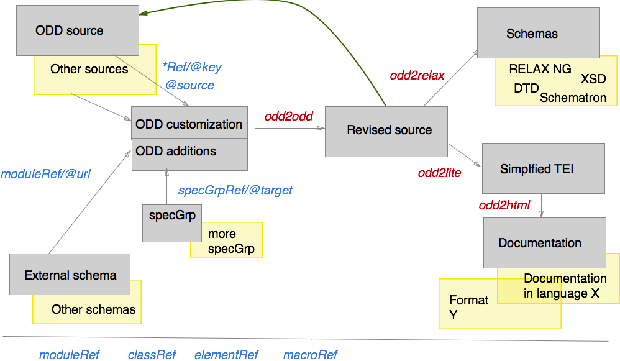
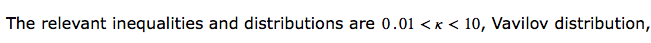
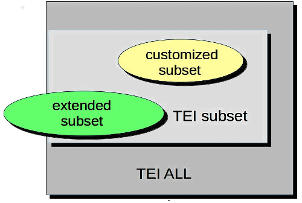

title: ODD&nbsp;: wait there's moreODD&nbsp;: Attendez, ce n’est pas tout&nbsp;!
description: ,
theme: theme/remark-dark-em.css
name: inverse
layout: true
class: inverse

---
class: center middle

# ODD&nbsp;: Attendez, ce n’est pas tout&nbsp;!


---
layout: false
name: index

# ODD &nbsp;: Attendez ce n’est pas tout&nbsp;!

* ODD comme système de documentation

* Définir des contraintes supplémentaires&nbsp;: utilisation de schematron

* Enchaînement et combinaison d’ODDs

* Documenter les intentions&nbsp;: le Processing Model

* Qu’est-ce qu’être conforme à la TEI&nbsp;?

---


# ODD comme système de documentation

ODD est un langage conçu pour faciliter la documentation systématique. Il fournit donc des balises spécialisées pour distinguer&nbsp;:
* `<code>`&nbsp;: un morceau de code exprimé dans n’importe quel langage formel
```xml
<code  lang="C">count += 56;</code>
```


* `<att>`&nbsp;: un nom d’attribut
```xml
<att  scheme="TEI">target</att>
```


* `<gi>`&nbsp;: un nom d’élément
```xml
<gi >table</gi>
```
---

# ODD comme système de documentation (suite)

* `<ident>`&nbsp;: identifiant ou nom d’un objet en n’importe quel langage formel
```xml
<ident  type="class">model.biblLike</ident>
```


* `<val>`&nbsp;: valeur d’attribut
```xml
<val >unknown</val>
```


* `<tag>`&nbsp;: balise XML
```xml
<tag >ptr target="http://www.bbc.co.uk"/</tag>
```


---


# Structuration d’un ODD

Mis à part le `<schemaSpec>` qui définit le schéma, on peut organiser le document comme tout autre document TEI, utilisant `<div>`, `<list>`, etc.

Au sein de ce document, des éléments supplémentaires sont prévus pour le regroupement des déclarations à l’extérieur du `<schemaSpec>`&nbsp;:

* `<specGrp>`&nbsp;: un regroupement de déclarations identifiable
```xml
<p >Nous n’utilisons que ces éléments du module <ident>linking</ident>&nbsp;:
  <specGrp xml:id="linkingElts">
  <!-- quelques elementSpec etc -->
  </specGrp>
</p>
```


* `<specGrpRef>`&nbsp;: indique où on souhaite intégrer les déclarations précisées par un `<specGrp>`
```xml
  <specGrpRef  target="#linkingElts"/>
```


---


# Un exemple très simple…

Ouvrir le fichier `tei_bare.odd` avec oXygen

Retrouvez l’élément `<schemaSpec>`

Examiner la structuration du fichier (utiliser la perspective `Outline/Sommaire` de oXygen)

---


# Un exemple plus ambitieux…

Ouvrir le fichier `tei_simplePrint.odd` avec oXygen

Retrouvez l'élément `<schemaSpec>`

Examiner la structuration du fichier (utiliser la perspective `Outline/Sommaire` de oXygen)

---


# Contraintes de données avec Schematron

* Une spécification d’élément peut proposer des contraintes supplémentaires sur son contenu en utilisant un ou plusieurs éléments `<constraintSpec>`

* Ces règles sont exprimées (typiquement) en utilisant le langage [ISO Schematron ](http://schematron.com/)

```xml
<elementSpec  ident="div" module="teistructure" mode="change">
    <constraintSpec ident="div" scheme="isoschematron">
      <constraint>
        <s:assert xmlns:s="http://purl.oclc.org/dsdl/schematron"
        test="@type='prose' and .//tei:p">une division prosaïque
        doit contenir au moins un paragraphe</s:assert>
      </constraint>
    </constraintSpec>
  </elementSpec>
```

---


# L’élément `<constraintSpec>`

Il définit une contrainte qui s’applique au sein de l’élément dans lequel il est déclaré

* L’attribut `@ident` est obligatoire&nbsp;: il fournit un identifiant unique

* Il rassemble un ou plusieurs `<constraint>`

* L’élément `<constraint>` contient (typiquement) un `<assert>` ou un `<report>`, éléments de l’espace de nommage `http://purl.oclc.org/dsdl/schematron`

---


# Fonctionnement des règles Schematron

* Le contenu de l’élément `<assert>` est affiché si le test est .red[false]

* Le contenu de l’élément `<report>` est affiché si le test est .red[true]

* Astuce&nbsp;: plusieurs éléments schematron sont disponibles pour enrichir le texte du message affiché, notamment `<name>` (context) et `<value-of>` (valeur)

Un schéma RNG intégrant ces règles sera auto-généré si l’on utilise le logiciel oXygen pour traiter son ODD

---


# Applications typiques des règles Schematron

* Contraintes de co-occurrence&nbsp;: « si l’attribut X a la valeur A, l’élément qui le porte doit contenir un Y »

* Contraintes arithmétique contextuelles&nbsp;: « au sein d’un `<titleStmt>`, on ne permet qu’un seul `<title>` »

* Contraintes textuelles&nbsp;: « Les caractères ' et “ ne sont pas permis au sein d’un `<p>` apparaissant dans le `<body>` »

* Contraintes contextuelles&nbsp;: « mots en français (`@xml:lang`='fr') ne sont pas permis au sein d’un élément latin (`@xml:lang`='la') »

* Intégrité référentielle&nbsp;: « un pointer exprimé sous la forme d’une URL et commençant par # doit correspondre à un élément ayant un `@xml:id` identique quelque part dans le document »

---


# Par exemple…

```xml
<constraintSpec  ident="isoconstraint">
     <constraint>
       <s:assert  xmlns:s="http://purl.oclc.org/dsdl/schematron"
       test="tei:fileDesc/tei:titleStmt/tei:title[@type='main']">
       il faut fournir un titre principal </s:assert>
     </constraint>
   </constraintSpec>
```

```xml
<elementSpec  ident="figure">
     <!-- ... -->
     <constraintSpec ident="demo-c2">
       <constraint>
         <s:report
          xmlns:s="http://purl.oclc.org/dsdl/schematron"
          test="not(tei:figDesc or tei:head)"> Votre figure ne
          contient ni un figDesc ni un head : aucun
          attribut <att>alt</att> n'est générable</s:report>
       </constraint>
     </constraintSpec>
  </elementSpec>
```

---


# Un schematron plus complexe (1)

```xml
<constraintSpec  ident="validtarget">
  <constraint>
    <rule xmlns="http://purl.oclc.org/dsdl/schematron"
    context="tei:*[@target]">
    <let name="results"
    value="for $t in tokenize(normalize-space(@target),'\s+')
    return starts-with($t,'#') and not(id(substring($t,2)))">
    </let>
    <report test="some $x in $results satisfies $x"> Erreur:
      Chaque pointer dans "<value-of select="@target"/>
      doit indiquer un ID dans ce même document
      (<value-of select="$results"/>)</report>
    </rule>
  </constraint>
</constraintSpec>
```

---


# Un schematron plus complexe (suite)

* `normalize-space(@target)`&nbsp;: supprimer les blancs non-signifiants

* `tokenize(normalize-space(@target),'\s+')`&nbsp;: couper la valeur de l’attribut dans des tokens séparés par des blancs

* `starts-with($t,'#')`&nbsp;: ne considérer que les pointeurs locaux

* `not(id(substring($t,2)))`: y-a-t il un attribut `@xml:id` dont la valeur correspond à la valeur indiquée en sélectionnant ce qui suit son 2<sup>ème</sup> caractère

* `some $x in $results satisfies $x`&nbsp;: expression XPath permettant la validation d’une séquence de valeurs booléennes (vraies/fausses)

---


# Chaining and combining ODDs



---

### Usage de l’attribut `@source`

L’attribut `@source` sert à spécifier la source des déclarations qu’on souhaite intégrer&nbsp;: par défaut dans la version la plus récente de TEI P5.

```xml
<schemaSpec  ident="test2" prefix="tei_" start="TEI"
  source="tei:1.5.0">
  <!-- dans la version 1.5.0 --></schemaSpec>
```

```xml
<schemaSpec  ident="test3" prefix="tei_" start="TEI"
  source="http://www.tei-c.org/Vault/P5/1.5.0/xml/tei/odd/p5subset.xml">
  <!-- version plus verbose du même --></schemaSpec>
```

```xml
<schemaSpec  ident="test4" source="myCompiled.odd">
  <!-- ensemble de déclarations maison --></schemaSpec>
```

`@source` peut être utilisé sur `<classRef>`, `<elementRef>`, `<macroRef>`, et `<moduleRef>`&nbsp;: il doit pointer vers un ODD compilé

---


# Compilation d'un ODD

* Transformer le fichier `tei_bare.odd` en « ODD compilé » avec oXygen en utilisant la feuille de style `${frameworks}/tei/xml/tei/stylesheet/odds/odd2odd.xsl`

* Regardez rapidement la sortie en profitant de l’affichage Outline

* Tous ces `<classSpec>` et `<dataSpec>` sont fournis par le module `tei`&nbsp;: ils sont constitutifs de l’infrastructure TEI.

* Enregistrez cette version sous le nom `tei_bare.compiled.odd`

---


# Usage d’un ODD compilé

Nous allons réutiliser TEI_bare, mais nous souhaitons supprimer l’élément `<head>`

```xml
<schemaSpec  ident="Bare-minus" source="tei_bare.compiled.odd"
 start="TEI">
  <moduleRef key="tei"/>
  <moduleRef key="header"/>
  <moduleRef key="core" except="head"/>
  <moduleRef key="textstructure"/>
</schemaSpec>
```

Notez qu’on ne peut supprimer ou modifier que les choses qui sont déjà présentes dans l’ODD compilé spécifié par l’attribut `@source`.

---


# Chaînage&nbsp;: super-ensemble

Nous allons réutiliser TEI_bare, mais nous souhaitons ajouter le module `gaiji`

```xml
<schemaSpec  ident="Bare-plus" source="tei_bare.compiled.odd"
 start="TEI">
  <moduleRef key="tei"/>
  <moduleRef key="header"/>
  <moduleRef key="gaiji"
   source="http://www.tei-c.org/release/xml/tei/odd/p5subset.xml"/>
  <moduleRef key="textstructure"/>
</schemaSpec>
```

Le `<moduleRef>` qui va fournir le module `gaiji` utilise son propre attribut `@source` pour spécifier où aller cherche les déclarations de ce module.

---


# Rétablir un élément supprimé

Nous allons ramener l'élément `<q>` qui a été effacé du schéma compilé&nbsp;:

```xml
<schemaSpec  ident="Bare-plus" source="tei_bare.compiled.odd"
 start="TEI">
  <moduleRef key="tei"/>
  <moduleRef key="header"/>
  <elementRef key="q" source="tei:3.0.0"/>
  <moduleRef key="textstructure"/>
</schemaSpec>
```

---


# Addition des composants d’une schéma nonTEI

On souhaite utiliser l’élément TEI `<formula>` et y insérer du contenu exprimé en MathML

Il nous faut donc&nbsp;:
1. inclure les composants du schéma MathML

1. modifier le modèle de contenu de l’élément `<formula>`

1. générer un schéma qui résout les conflits de nommage


ATTENTION&nbsp;: il y a un élément `<list>` dans TEI mais également dans MathML&nbsp;!

---


# TEI + MathML&nbsp;: le ODD

```xml
<schemaSpec  ident="tei_math" prefix="tei_"
 start="TEI teiCorpus">
  <moduleRef
  url="http://www.tei-c.org/release/xml/tei/custom/
  schema/relaxng/mathml2-main.rng"/>
  <moduleRef key="header"/>
  <moduleRef key="core"/>
  <moduleRef key="tei"/>
  <moduleRef key="textstructure"/>
  <moduleRef key="figures"/>
  <elementSpec module="figures" ident="formula" mode="change">
    <content>
      <elementRef key="mathml.math"/>
    </content>
  </elementSpec>
</schemaSpec>
```

L’attribut `@prefix` nous permet de désambiguïser les identifiants ressortant des schémas différentes

---


# TEI + MathML&nbsp;: le document



```xml
<p >The relevant inequalities and distributions are
   <formula notation="MathML">
     <math xmlns="http://www.w3.org/1998/Math/MathML"
      overflow="scroll">
        <mn>0</mn>
        <mo>.</mo>
        <mn>0</mn>
        <mn>1</mn>
        <mo><</mo>
        <mi>κ</mi>
        <mo><</mo>
        <mn>1</mn>
        <mn>0</mn>
     </math>
   </formula>, Vavilov distribution, and ... </p>
```

---

# Ajout d’un processing model (modèle de traitement)

Vous pouvez également enrichir votre documentation avec des déclarations plus précises sur la manière dont des éléments particuliers devraient être mis en forme.

Cela est complémentaire aux fonctionnalités offertes avec `@rend` et `@style` qui décrivent la manière dont la source originale (non-digitale) a été formattée.

Les nouveaux éléments `<model>`, `<modelGrp>`, `<param>`, `<outputRendition>`

Le concept de `behaviour` est introduit pour définir des concepts de formattage employés communément, par exemple, « block », « inline », « pointer », etc.

```xml
<elementSpec  mode="change" ident="quote">
    <model predicate="ancestor::p" behaviour="inline"/>
    <model predicate="not(ancestor::p)" behaviour="block"/>
  </elementSpec>
```
« Process a `<quote>` inside a `<p>` as an inline; elsewhere as a block »
---


# Variétés de ODD



Chacune de ces formes représente&nbsp;:

* un ODD

* le schéma généré à partir de cet ODD

* l'ensemble de documents considérés comme valide par ce schéma

---


# Variétés de ODD


* un « TEI subset » fournit un sous-ensemble des composants constituant TEI All

* un « customised subset » est également un sous-ensemble avec des personnalisations supplémentaires

* un « extended subset » contient des composants qui ne font pas partie de TEI All

---


# Le plus simple

* Vos modifications génèrent un schéma réduit, plus précis, plus adapté à votre projet et une documentation plus exacte et correcte pour votre communauté d'utilisateurs

* Mais vos documents restent toujours valides par rapport à TEI All et vous respectez toujours le modèle sémantique de la TEI.

* Les extensions éventuelles sont signalées clairement, en utilisant une autre espace de nommage, et sont d’ailleurs expliquées dans votre ODD

---


# Qu’est-ce signifie «&nbsp;être conforme à la TEI&nbsp;»&nbsp;?

* .red[être honnête]&nbsp;: Les éléments XML qui sont déclarés comme appartenant au namespace TEI doivent respecter les définitions TEI de ces éléments

* .red[être explicite]&nbsp;: Pour valider un document TEI, un ODD est fortement conseillé, parce que cela mettra en évidence toutes les modifications effectuées.

Plus formellement, pour un document TEI conforme&nbsp;:
* il doit être un document XML bien-formé

* si la construction de son schéma ne prend en compte que les éléments appartenant à l’espace de nommage TEI, l'ensemble de documents considéré comme valide par ce schéma devrait être un sous-ensemble de l'ensemble de documents considéré valide par le schéma TEI-ALL.

* Tout autre élément présent doit appartenir à un autre namespace


L’objet de ces règles est de simplifier le « blind interchange » des documents&nbsp;; elles ne le garantissent pas.

---


# Les limites de la modification

* Est-ce que l’on peut supprimer n’importe quoi&nbsp;? par ex. `<title>`&nbsp;?

* A quoi servent les classes vides ?

* Est-ce qu’on peut ajouter n’importe quoi&nbsp;? quelles limitations&nbsp;?

L’enjeu c’est de permettre a un utilisateur de comprendre votre encodage, non pas forcement de le contraindre a vous suivre aveuglement&nbsp;!
